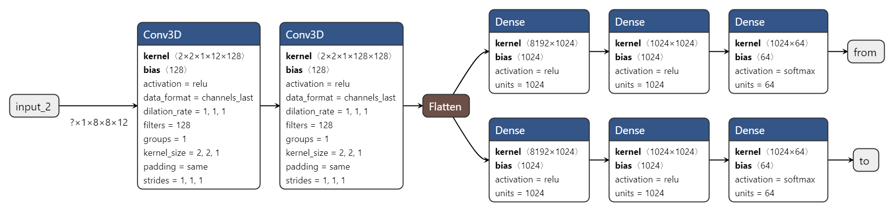
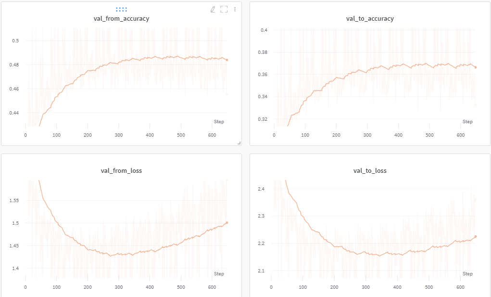

# ChessEngine
A simple chess AI.

<a href="https://hybrid-chess-app.herokuapp.com/"><h1>Play against it!</h1></a>

## Dataset
---

- The dataset used was downloaded from <a href="https://www.ficsgames.org/download.html">FICS</a>
- A total of 97,000 games were used, with a sample size of 71,00,000.
 

## Pre-processing
---

- The chess board was encoded to a 8x8x12 matrix (one hot encoded for each piece type - color variant).
- For every white move, both the board and the move were flipped horizontally and vertical, to "pretend" as if it was black's move. (This improved the validation accuracy from 37% -> 49%)
- The move was split into a from-square vector and a to-square vector (both of length 64, one-hot encoded), which acted as labels for the problem.
 

## Model
---

  

- The model was trained on colab for 13 epochs. 
- Validation accuracy achieved : 
&nbsp;- "From" output - 49% 
&nbsp;- "To" output - 37%

  

 

## Deployment
---- 

- To render the chess board, <a href="https://chessboardjs.com/">chessboard.js</a> was used.
- This UI was connected to the model through an API of Flask backend.
- Finally the whole application was deployed on Heroku.
 

## To do:
----
- Improve the engine by introducing minimax (partially).
 

## References
- <a href="https://pdfs.semanticscholar.org/28a9/fff7208256de548c273e96487d750137c31d.pdf?source=post_page---------------------------"> Stanford paper</a>
